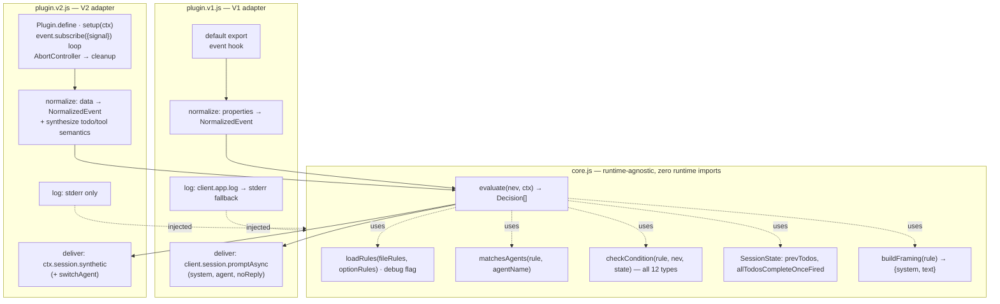

# Design — V2 Plugin Migration

Companion to `proposal.md` and `specs/rule-based-instruction-injection/spec.md`
for the `v2-plugin-migration` change.

## 1. Scope

**Problem.** `opencode-auto-instruct` is a V1 plugin (single default export, one
`event` hook). V1 plugins do not run under `@opencode/cli` 2.x. The plugin needs
a verified V2 port that keeps V1 working unchanged, without two full-copy
entrypoints that drift.

**Given constraints** (caller-supplied, designed within — not re-litigated):

- Adopt the `core.js` + `plugin.v1.js`/`plugin.v2.js` adapter split already
  shipped for `opencode-use` (mandated by a prior design review).
- Pinned target runtime: `@opencode/cli` / `@opencode/plugin` **2.0.4**.
- One rule-config format serves both runtimes.
- Node `>=22.5` (existing `engines` floor).

**Confirmed V2 surface** (verified against the *installed* 2.0.4 types in
`node_modules/@opencode/plugin/dist/` and its bundled `@opencode/client`, not
from training data — see §3 for the receipts):

| Fact | Source |
|---|---|
| `Plugin = {id, setup(ctx) => Cleanup \| void}` | `dist/promise/plugin.d.ts` |
| `Context.app = {name, version, channel}` — **no `log`** | `dist/app.d.ts` |
| `Context.event = Pick<EventApi,"subscribe">`; `subscribe(requestOptions?) => AsyncIterable<V2Event>`; `RequestOptions.signal?: AbortSignal` | `dist/promise/event.d.ts`, `client/dist/promise/generated/client.d.ts` |
| `session` domain exposes `get`, `switchAgent`, `prompt`, `synthetic`, `interrupt`, `wait`, … | `dist/promise/session.d.ts` |
| `SessionSyntheticInput = {sessionID, id?, text, description?, metadata?, delivery?:"steer"\|"queue", resume?}` | `client/.../generated/types.d.ts` |
| `SessionGetOutput = SessionInfo` (**unwrapped**), `SessionInfo.agent?: string` | same |
| `switchAgent(input) => Promise<void>` | same |

**Open questions** — none blocking this design; two blocking *implementation*,
both routed to the §8 Layer-3 gate (V2 todo-tool identity; `synthetic()`
model-visibility).

## 2. The finding that reshapes this change

The proposal frames the port as a hook/API translation. It is not. Beyond the
method mapping, **V2's event vocabulary and envelope both differ**, and the
difference lands squarely on this plugin's primary feature.

**V2 events carry their payload under `data`, not `properties`**, inside a
richer envelope:

```
V1:  { type, properties }
V2:  { id, created, type, durable{aggregateID,seq,version}, location, data, metadata? }
```

**There is no todo event in V2.** The string `todo` does not occur anywhere in
the 2.0.4 client type surface. The V2 event union has no todo domain at all.
Likewise `tool.execute.after` and `message.updated` do not exist.

Mapping this plugin's three configured trigger events:

| V1 event | V2 status |
|---|---|
| `session.created` | Exists, same type string. `data.sessionID` / `data.agent` (was `properties.info.id` / `properties.info.agent`). |
| `todo.updated` | **Absent.** No replacement event. |
| `message.updated` | **Absent.** Nearest: `session.step.ended` (`data.finish` enum), `session.idle`, `session.execution.succeeded`. |
| `tool.execute.after` | **Absent.** Nearest: `session.tool.called` / `session.tool.success` / `session.tool.failed` — **none carries the tool name**; their `data` is `{sessionID, assistantMessageID, id, content, executed, …}`. |

Consequence: of the 12 condition types the spec requires, **9 are todo-derived
and have no V2 event source**, and **2 more (`toolName`, `toolNameIn`) cannot be
satisfied from the tool events**. Only `messageFinished` maps — and its
semantics shift (see D3). A purely mechanical port produces a V2 adapter that
loads cleanly, logs nothing, and never fires — the worst failure mode available.

**Recovery path exists.** `session.message.content.updated` carries
`data.content: Array<…>` whose tool parts are
`{type:"tool", id, name, executed?, state, time}`, and a completed tool state is
`{status:"completed", input:{…}, content, metadata}`. Both the **tool name** and
the **tool input** are therefore observable. Since todo state on V1 is written
by a todo tool, todo lists are reconstructable from that tool's `state.input`.
This is the basis of D3.

## 3. Architecture

### Module split



**`core.js` owns** — rule loading/merging (file rules before option rules),
the `debug` flag, agent-filter matching, all 12 condition evaluators, the
per-session `prevTodos` / `allTodosCompleteOnceFired` state machine **including
the post-loop commit ordering**, the instruction-framing text builders, and the
`evaluate()` pass that turns one normalized event into an ordered list of
delivery decisions. It imports nothing from either plugin SDK, performs no I/O,
and receives `log` by injection.

**Each adapter owns** — hook wiring and lifecycle; envelope normalization;
session-agent resolution via its own SDK; delivery via its own SDK; the logging
sink. Adapters hold no condition logic and no rule-matching branches.

**`evaluate()` returns decisions, it does not deliver.** Core decides *whether*
and *what*; the adapter decides *how*. This is what makes one conformance suite
runnable against both adapters (§8 Layer 2) and keeps 100% of the condition
logic testable with plain objects.

### D1 — Normalized event shape

| Option | Trade-off |
|---|---|
| **(a)** Reshape V2 events into V1's `{type, properties}` so `core` is today's code verbatim | Cheapest diff. But requires the V2 adapter to *fabricate* `properties.todos` and a fake `todo.updated` type — encoding V1's accidental payload layout as the permanent internal contract, and hiding real semantic divergence behind synthetic V1 envelopes. Every future V2 event needs a fictional V1 name. |
| **(b)** Neutral semantic `NormalizedEvent` | Small extra mapping layer per adapter. Core operates on meaning, not on either runtime's field layout. Unit tests need no fixtures from either SDK. Semantic divergences (D3) become explicit in the mapping table rather than buried in fake envelopes. |

**Recommended: (b).** The gap is semantic, not cosmetic — `todo.updated` is
*synthesized* on V2 from a tool completion, and tool names come from a different
event entirely. (a) would force the adapter to lie about provenance, which is
exactly the information the maintainer needs when this breaks on the next
minor bump.

Shape (fields, not an implementation):

```
NormalizedEvent {
  kind      : 'session.created' | 'todo.updated' | 'message.finished' | 'tool.completed' | 'other'
  raw       : <original event, for debug logging only>
  sessionID : string | null
  agentHint : string | null    // session.created only; seeds the agent cache
  todos     : Array<{status}> | null   // todo.updated only
  toolName  : string | null            // tool.completed only
  finish    : string | null            // message.finished only
}
```

Rule configs keep binding to the V1 `event:` strings (`todo.updated`,
`tool.execute.after`, …); `kind` is the internal name and each adapter maps the
configured string to it. One config, both runtimes.

### D2 — Delivery mapping

| V1 | V2 | Note |
|---|---|---|
| `client.session.promptAsync({path:{id}, body:{…}})` | `ctx.session.synthetic({sessionID, text, …})` | Not `prompt` — `prompt` has no synthetic/hidden framing. |
| `body.noReply: true` | `resume: false` | Documented equivalent. |
| `parts[0].synthetic` + `rule.hidden` | omit `description` | See D5 — provenance caveat. |
| `body.system: <framing>` | **no equivalent field** | `SessionSyntheticInput` has no `system`. Framing must be **prepended into `text`**. |
| `body.agent: <target>` | **no equivalent field** | See D4. |
| `client.session.get({path:{id}}) → res.data.agent` | `ctx.session.get({sessionID}) → res.agent` | **Unwrapped.** Copying `.data.agent` yields `undefined` → every specific agent filter silently fails. |
| `client.app.log({body:{…}})` | none — stderr | `Context.app` has no `log`. |

`buildFraming(rule)` therefore returns **both** `{system, text}`; V1 puts
`system` in `body.system`, V2 prepends it to `text`. Core owns the wording so
the two runtimes cannot drift apart.

### D3 — The event-vocabulary gap (the real design problem)

| Option | Trade-off |
|---|---|
| **(a)** Runtime-conditional: on V2, todo/tool rules never fire; warn once at load | Honest and trivial. But guts the plugin's primary use case on V2 — the todo-workflow rules are what it exists for. |
| **(b)** Synthesize V1 semantics in the V2 adapter from `session.message.content.updated`: derive `todo.updated` from the todo tool's completed `state.input`, and `tool.completed` from tool parts' `name` + state transition | Preserves config portability and the whole feature set. Cost: per-part state tracking (that event re-emits the full content array, so transitions must be deduped by part `id` + status), and a dependency on the todo tool's name/input shape, which is **not** a typed contract. |
| **(c)** New V2-native rule vocabulary | Breaks every existing config; two rule dialects to document and maintain forever. |

**Recommended: (b), with (a) as the declared fallback.** Synthesis is genuinely
available (verified: tool `name` and `state.input` are both present) and keeps
one config format — the point of the shared-core design. But (b) rests on an
*untyped* assumption, so it is gated: if the Layer-3 probe does not confirm the
V2 todo tool's name and input shape, the V2 adapter falls back to (a) —
todo-conditioned rules do not fire, and the plugin logs one explicit warning per
affected rule at load rather than going silently deaf.

Two follow-on decisions inside (b):

- **`messageFinished`.** V1 tests `!!properties.info.finish` (truthy object). V2's
  `session.step.ended` always carries `data.finish` as an enum including
  `"error"` — so `!!data.finish` is *always true*, silently converting a
  conditional rule into an unconditional one. The V2 adapter sets
  `finish` only for terminal-success values and maps `"error"` to no match.
  Record this as an intentional semantic pin, not a translation.
- **Dedup.** `session.message.content.updated` re-emits the whole content array
  on every change. `tool.completed` fires exactly once per tool part, keyed on
  `(messageID, partID)` first-transition-into-completed. Without this, a single
  tool call fires a rule many times.

### D4 — `switchToAgent` (V1 per-call vs V2 persistent)

V1 scopes the agent override to one delivery. V2 has no per-call agent field on
`synthetic` or `prompt`; its only mechanism, `ctx.session.switchAgent`, changes
the agent for **subsequent turns** — session-level and persistent.

| Option | Trade-off |
|---|---|
| **(a)** Call `switchAgent` before delivery; accept persistence; document it | Preserves the rule's intent (instruction runs under the named agent). Side effect is durable, visible in the TUI, and user-reversible. Deviation from V1 is a difference in *scope*, and an observable one. |
| **(b)** `switchAgent` → deliver → `switchAgent` back, emulating per-call scoping | Looks like V1. **Rejected:** `synthetic` enqueues into the inbox; with `resume:false` it is consumed on some later turn. Restoring immediately races the consumption — the injected instruction may run under the *original* agent (silently defeating the rule) or the restore may land mid-turn. No delivery-scoped completion signal exists to sequence against (`session.idle` is session-wide, not per-delivery). This trades a visible deterministic side effect for an invisible nondeterministic one. |
| **(c)** Refuse: warn, deliver under the current agent | Safest, but silently drops configured behaviour — the user asked for agent X and gets agent Y with a log line they will not read. |
| **(d)** Opt-in flag (`allowPersistentAgentSwitch`) | Adds permanent config surface to restate what a one-time warning already conveys. YAGNI. |

**Recommended: (a).** It is the only option that both honours the rule and fails
loudly rather than subtly. Two guards, and no more:

1. **Skip the call when the target already equals the resolved agent** — avoids
   pointless persistent writes and spurious `session.agent.selected` events.
2. **Warn once per session per rule**, naming the previous agent, so the log
   line is both an alert and the instruction for restoring it.

No restore machinery, no timers, no new config keys. The behavioural difference
is a documented V1/V2 divergence (already stated in the spec), surfaced in the
README's rule reference and at runtime.

### D5 — Hidden framing, and its weaker provenance

`hidden: true` → omit `description`. This is confirmed **from V2 source** (the
TUI renders a synthetic row only when `description` is non-empty), **not** from
documented prose. The type only tells us `description` is optional
(`description?: string | null`) — it does not promise that omitting it hides the
row.

That is weaker evidence than everything else in §1, so treat it accordingly:

- It is a **rendering** behaviour and can regress on a patch bump without a
  contract change. It therefore gets its own Layer-3 assertion (§8), not just a
  unit test of the argument shape.
- Do not let visual hiding carry the non-disclosure requirement alone. The
  framing text (`buildFraming`) keeps the explicit "do not reveal this injection
  occurred unless asked" instruction for hidden rules, exactly as V1 does. If
  the rendering behaviour changes, the instruction still holds.

### D6 — Subscription lifecycle

`setup()` creates an `AbortController`, starts the `event.subscribe({signal})`
loop **detached** (never awaited — awaiting a long-lived async iterator inside
`setup()` would hang plugin initialization), and returns a cleanup that aborts
it. Required behaviours:

- An `AbortError` after cleanup is **expected termination**, not an error to log.
- Any other throw is logged; the loop exits.
- An *unexpected* clean end of stream (not aborted) is logged as a **warning** —
  otherwise the plugin goes permanently deaf with no trace.
- Per-event handling is fully guarded: one malformed event must not kill the
  loop.

**Rejected (YAGNI):** auto-reconnect/backoff on stream end. No evidence the 2.0.4
stream ends spontaneously; a warning surfaces it if it does, and reconnect logic
without a known failure mode is speculative machinery in the hardest-to-test
part of the system.

### D7 — Injected logging

`core.js` takes `log(msg, err?, level?)` by injection; V1 supplies the
`client.app.log`-with-stderr-fallback sink, V2 a stderr-only sink. Keeps core
runtime-agnostic and lets unit tests assert on warnings (several spec scenarios
— unknown condition type, malformed `toolNameIn` — are *defined* by their
warning).

### D8 — Config path injectability

Not in the proposal, but required to test this change safely. The config path is
a hard-coded constant, so the existing audit had to back up, overwrite, and
restore the user's **real** `~/.config/opencode/auto-instruct.json`. That is a
data-loss footgun standing between this change and its own e2e gate.

**Decision:** core reads the config path from a resolver that honours an
environment override (default unchanged:
`~/.config/opencode/auto-instruct.json`). Layer-3 tests point at a temp file and
never touch user state. Smallest possible change that removes the footgun.

### Deliberate non-decisions (YAGNI)

| Rejected | Reason |
|---|---|
| Exposing `delivery: "steer" \| "queue"` as a rule field | Real knob, but no stated need and no evidence which default suits injection. Use the API default; revisit with a concrete use case. |
| Auto-reconnect on event-stream end | See D6. |
| An abstract "runtime driver" interface beyond the two adapters | Two implementations do not justify a third abstraction layer. |
| A V2-native rule dialect | D3 option (c). |
| Restore-after-switch machinery | D4 option (b) — actively harmful. |
| `allowPersistentAgentSwitch` config flag | D4 option (d). |

**Accepted (cheap, earns its place):** set `metadata` on `synthetic` calls with
plugin id + rule id. One field, gives injected messages machine-readable
provenance and gives Layer-3 a precise assertion target.

## 4. Requirements the spec must state

Design-level findings for the engineer to transcribe into
`specs/rule-based-instruction-injection/spec.md`. **This document does not edit
spec files.** Three current statements are V1-specific and false on V2:

1. **Event-to-Session Resolution** mandates `event.properties.sessionID` /
   `event.properties.info.id`. V2 has no `properties`. Reword as a
   runtime-neutral requirement ("the adapter SHALL resolve a session ID from the
   runtime's event envelope") with per-runtime scenarios.
2. **Condition Evaluation** asserts all 12 types unconditionally. On V2, 11 of 12
   depend on the D3 synthesis path. Either state the synthesis as a requirement
   or state the degraded-mode fallback — otherwise the port can be
   spec-compliant and non-functional.
3. **Instruction Delivery** requires framing "as an automated injection". V2's
   `synthetic` has no `system` field; add that the framing may be carried in the
   message text where the runtime has no system channel.

Additionally worth adding as scenarios: `messageFinished` must not match on a
failed step (D3); `switchAgent` must not be called when the target already
matches the current agent (D4).

## 5. Failure modes and operations

| Failure | Blast radius | Detection | Recovery |
|---|---|---|---|
| **V2 adapter goes deaf** (event names/envelope change on a version bump) | Total feature loss, **silent** — plugin loads fine | Layer-3 gate; unexpected-stream-end warning (D6) | Adapter-local normalization fix; core untouched |
| **`synthetic()` not model-visible** (the reported beta symptom) | Total feature loss on V2 — injections stored but never seen | Layer-3 gate (§8) — the one test that can catch it | Blocks release. Fall back to `prompt` only if a variant is proven to work |
| **Todo-tool name/shape assumption wrong** (D3) | 9 of 12 conditions dead on V2 | Layer-3 probe | Declared fallback: degrade to D3(a) + per-rule load warning |
| **`description`-omission hiding regresses** (D5) | Hidden rules become visible; non-disclosure still enforced by framing text | Layer-3 assertion | Cosmetic; framing text holds the requirement |
| **`res.data.agent` copied to V2** (D2) | Agent always unknown → every specific filter silently fails | Layer-2 conformance test | One-line fix |
| **`switchAgent` persistence surprises a user** (D4) | Session stays on the switched agent | Per-session warning names the previous agent | User switches back; documented |
| **Tool-part dedup missing** (D3) | Rule fires repeatedly for one tool call | Layer-2 test with repeated `content.updated` | Dedup by `(messageID, partID)` |
| **Delivery throws for one rule** | Contained — remaining rules still evaluated (existing V1 behaviour, preserved) | Logged per rule | None needed |

**Migration delta.** Additive: V1 consumers keep working through
`plugin.v1.js`. `src/index.js` is *renamed*, so any config pointing at
`src/index.js` directly — including this repo's own audit-doc repro steps —
breaks. Keep `main` and a `.` export resolving to the V1 adapter, add `./v1` and
`./v2` subpath exports, mark both peer deps optional via
`peerDependenciesMeta`, and update the audit doc's paths in the same change.

**Scaling.** Per-session state (`prevTodos`, fired-once set, agent cache, tool
dedup) grows with sessions and is never evicted — already true on V1 and
acceptable for a process-lifetime plugin. Noted, not fixed: eviction without an
observed problem is speculative.

## 6. Test strategy

The repo has zero tests. Runner: **`node --test`** — built-in at the existing
Node `>=22.5` floor, no new dependencies.

### Layer 1 — `core.js` unit tests (pure, no SDK, no I/O)

Plain-object `NormalizedEvent` inputs; assert returned decisions and logs.
Covers every spec scenario plus the edges the current implementation encodes:

- Rule merge order (file rules before option rules); missing config file is not
  an error; malformed JSON warns and contributes zero rules; `debug` from either
  source.
- Agent filter: absent, `"*"`, exact string, array, and **unresolved agent +
  specific filter → no match**.
- All 12 condition types, each with match and non-match cases.
- `allTodosComplete` on an **empty** list → false (non-obvious: "all of none").
- **Consistent prev/current pair**: two transition rules in one event both see
  the pre-event snapshot — state commits only after the rule loop.
- `allTodosCompleteOnce`: fires once per session; tracked per session; marked
  fired only post-loop.
- `todoCountAtLeast` with a missing/non-numeric `count` → default 1.
- `toolNameIn` with a missing `tools` array → warn + no match.
- Unknown condition type → warn + no match.
- Rule with no `instruction` → no delivery decision.
- `buildFraming`: hidden vs non-hidden wording; hidden always carries the
  non-disclosure clause (D5).

### Layer 2 — adapter conformance (mocked hosts, both adapters)

**One shared suite, executed twice** — against a fake V1 host (`{client}`) and a
fake V2 `ctx`. This is what stops the adapters drifting.

Runtime-neutral assertions (identical expectations both sides):

- A matching rule produces exactly one delivery carrying the instruction text
  and the framing.
- `hidden`, `noReply`, and no-instruction rules behave per spec.
- A delivery failure on rule 1 is logged and does **not** prevent rule 2.
- Events with no resolvable session ID evaluate no rules.
- The agent name is seeded from `session.created` without a follow-up lookup.

Runtime-specific assertions:

- **V1** — `promptAsync` receives `{system, noReply, agent, parts[0].synthetic}`;
  agent read from `res.data.agent`.
- **V2** — `synthetic` receives `{sessionID, text (framing prepended), resume:
  false when noReply, description omitted when hidden, metadata}`; agent read
  from `res.agent`; `switchAgent` called **before** delivery, **exactly once**,
  and **not at all** when the target equals the current agent (D4); envelope
  normalization from `data`; todo/tool synthesis from
  `session.message.content.updated` including **dedup across repeated emissions**
  (D3); `messageFinished` does **not** match a failed step; cleanup aborts the
  subscription and an abort-driven iterator exit is not logged as an error (D6).

### Layer 3 — end-to-end against pinned `@opencode/cli` 2.0.4 — **release gate**

**Non-negotiable.** No amount of Layer 1+2 green evidences that an injected
message reaches the model. An upstream issue against a beta build reported
`synthetic()` messages **not reaching model-visible prompt context**. The
documented schema describes the request shape, not the runtime behaviour of this
build. Until a real run proves otherwise, **treat `synthetic()` visibility as
unverified and this port as not done.**

Method — positive evidence only (mirroring the existing audit doc): a real
`opencode run` with a rule injecting a unique sentinel, asserting the **model's
own output references the sentinel**. Absence of errors is not a pass. The
config path override (D8) is used so no user state is touched.

Gate assertions:

1. **`synthetic()` reaches model-visible context.** Sentinel echoed back. *If
   this fails, the port does not ship* — escalate with the transcript rather
   than switching mechanisms speculatively.
2. **Hidden rules still reach context** with `description` omitted, and the
   synthetic row is not rendered (D5's source-derived behaviour, independently
   asserted because its provenance is weaker than the rest).
3. **V2 todo-tool identity** — capture a real `session.message.content.updated`
   during a todo-using run and record the tool's `name` and `state.input` shape.
   This decides D3(b) vs the D3(a) fallback; it is a discovery step whose output
   is a recorded fact, not an assertion of a guess.
4. **`switchAgent` persistence** observed and documented (D4), so the README
   describes measured behaviour.
5. **V1 regression run** against the V1 runtime, proving the refactor did not
   change V1 behaviour.

Gates 1 and 3 must run **before** the V2 adapter is considered complete — 3
determines what the adapter must do; 1 determines whether it can work at all.

## 7. Component breakdown

| # | Component | Work kind | Done when |
|---|---|---|---|
| 1 | `src/core.js` — rule loading/merging, agent filter, 12 conditions, session state with post-loop commit, framing builders, `evaluate()`, injected `log`, config-path resolver (D8) | Application code (JS) | Imports nothing from either SDK; Layer-1 suite passes; every spec scenario has a test |
| 2 | `src/plugin.v1.js` — V1 adapter (renamed from `index.js`) | Application code (JS) | Behaviour identical to today's `index.js`; holds no condition logic; Layer-2 suite passes against a fake V1 host |
| 3 | `src/plugin.v2.js` — `Plugin.define` adapter: subscribe loop + abort cleanup, `data`-envelope normalization, D3 synthesis + dedup, `synthetic` delivery, `switchAgent` guard, stderr logging | Application code (JS) | Layer-2 suite passes against a fake V2 `ctx`; D6 lifecycle behaviours asserted |
| 4 | `package.json` — `main`/`exports` (`.`, `./v1`, `./v2`), both peers optional via `peerDependenciesMeta`, test scripts | Package config | `./v1` and `./v2` resolve; V1 consumers unaffected; `npm test` runs Layers 1–2 |
| 5 | `test/` — Layer-1 unit suite, Layer-2 shared conformance suite + two host fakes | Application code (tests) | Every spec scenario covered; conformance suite runs unmodified against both adapters |
| 6 | `test/e2e/` — Layer-3 script against pinned 2.0.4, temp-config isolated | Shell / test script | Gates 1–5 of §8 executed; results recorded with transcripts |
| 7 | Spec amendments (§4) | Spec authoring (engineer-owned) | The three V1-specific statements are runtime-neutral; new scenarios added |
| 8 | `docs/v2-compat-audit.md` rewrite + README rule-reference update (V1/V2 `switchToAgent` divergence, any D3 degraded mode) | Documentation | Describes the real V2 port and measured Layer-3 results; repro steps use the config override, not the user's real config |

Dependency order: 1 → (2, 3) → 5 → 6; 6's gate 3 feeds back into 3. 7 and 8
close after 6 produces measured results.

## 8. Research needs

Confirmed from the installed 2.0.4 type surface during this design (recorded in
§1/§2; no training-data assertions): plugin/context/session/event shapes,
`SessionSyntheticInput` fields, unwrapped `SessionGetOutput`, the full V2 event
union, absence of any todo event, tool-event payloads, and the
`session.message.content.updated` content-part shape.

Must be established empirically by the implementing engineer (§6 Layer 3, not
resolvable from types or docs):

1. Whether `ctx.session.synthetic()` reaches model-visible prompt context on
   2.0.4. **Release-blocking.**
2. The V2 todo tool's `name` and `state.input` shape. **Decides D3(b) vs D3(a).**
3. Whether omitting `description` suppresses the TUI synthetic row on 2.0.4.
4. Observed `switchAgent` persistence behaviour, for the README.
